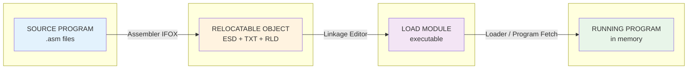
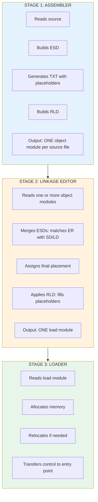

# How the IFOX Assembler Builds Relocatable Object Files

A guide for non-mainframe experts: passes, ESD, RLD, and the assembly-to-execution pipeline.

---

## Color Key

| Color | Meaning |
|-------|---------|
| Source / Input | What goes in |
| Processing | Transformation steps |
| Metadata (ESD, RLD) | Control information |
| Machine Code | Executable output |
| Storage / Files | Workfiles, object deck |

---

## The Big Picture: From Source to Running Program

**Pipeline:** Source → Object (ESD+TXT+RLD) → Load Module → Running Program

---

## Part 1: The Assembler's Multi-Pass Design

### Why Multiple Passes?

In the 1970s, mainframe memory was tiny (often 64K–256K bytes). You could not hold a full program and all its tables in memory at once. The solution: **process the source in several passes**, each doing one job and writing intermediate results to disk.

<strong>1970s CONSTRAINT: Limited Memory</strong>
<ul style="margin:8px 0 0 0;">
<li>System/360 "F" machine = 64K total (20K for OS, ~44K for programs)</li>
<li>Assembler must fit in memory AND process large source files</li>
<li>Solution: Read source once per pass, write to workfiles (SYSUT1-3)</li>
<li>Each phase loads, runs, then is DELETED to free memory for the next</li>
</ul>

### The IFOX Phase Flow

IFOX uses **phases** (subroutines loaded one at a time) instead of a single monolithic program:

IFOX DRIVER (stays in memory)

LOAD → RUN → DELETE (free memory) → LOAD next...

EDIT (X11)
→
DICT RES. (X21)
→
GEN (X31)
→
SYMBOL RES. (X41/42)
→
OUTPUT LISTER (X51)
→
RLD & XREF (X61)

WORKFILES (SYSUT1, SYSUT2, SYSUT3) — intermediate data between phases

**Pass A (Edit + Generate):** Read source, expand macros, build symbol tables.  
**Pass B (Dictionary + Generator):** Resolve symbols, generate object code.  
**Output:** Relocatable object deck (80-byte records) to SYSGO (object file).

---

## Part 2: The Relocatable Object File — ESD, TXT, RLD

The assembler writes a **relocatable object module**: machine code plus metadata so the linkage editor and loader can place and fix addresses later.

### Object Module Structure (80-byte card format)

OBJECT MODULE = sequence of 80-byte records (like punched cards)

ESD (External Symbol Dictionary) — MUST COME FIRST

Who is defined here? What do we need from elsewhere? 
SD=Section, LD=Label/Entry, ER=External Ref, PR=Pseudo-Register

↓

TXT (Text) — Machine code and data

Actual bytes to load. Addresses are RELATIVE (not final).

↓

RLD (Relocation & Linkage Dictionary) — Where to fix addresses

"At offset X in section Y, put the address of symbol Z"

↓

<strong>END</strong> — End of module

### ESD: The "Phone Book" of Symbols

ESD = External Symbol Dictionary

Answers: "What symbols does this module define? What does it need?"

<table style="width:100%;border-collapse:collapse;">
<tr style="background:#e65100;color:white;"><th style="padding:8px;text-align:left;">TYPE</th><th style="padding:8px;text-align:left;">MEANING</th><th style="padding:8px;text-align:left;">EXAMPLE</th></tr>
<tr style="border-bottom:1px solid #ddd;"><td style="padding:8px;">SD</td><td style="padding:8px;">Section Definition</td><td style="padding:8px;">"MYCODE" is a 100-byte code section</td></tr>
<tr style="border-bottom:1px solid #ddd;"><td style="padding:8px;">LD</td><td style="padding:8px;">Label Definition</td><td style="padding:8px;">"START" is an entry point at offset 0</td></tr>
<tr style="border-bottom:1px solid #ddd;"><td style="padding:8px;">ER</td><td style="padding:8px;">External Reference</td><td style="padding:8px;">"PRINT" is defined somewhere else</td></tr>
<tr><td style="padding:8px;">PR</td><td style="padding:8px;">Pseudo-Register (XD)</td><td style="padding:8px;">"BUF" is a dummy section for addressing</td></tr>
</table>

### RLD: The "Fix-Up List"

The assembler does **not** know final addresses. It emits **placeholders** and records where they are:

RLD = Relocation & Linkage Dictionary

Each RLD entry says: "At this location, put the address of that symbol"

Source: &nbsp;&nbsp;&nbsp;E &nbsp;&nbsp;DC &nbsp;&nbsp;A(EXTERNAL+4) &nbsp;&nbsp;&nbsp;&nbsp;&nbsp;&nbsp;&nbsp;← Address constant, value unknown

↓

RLD entry: R=EXTERNAL's ESDID, P=this section, Address=offset, Length=4, Type=A

<strong>When the LINKAGE EDITOR runs:</strong>
<ol style="margin:4px 0 0 0;">
<li>It knows where EXTERNAL ended up (from ESD of another module)</li>
<li>It finds the TXT byte at the given offset</li>
<li>It REPLACES the placeholder with the real address</li>
</ol>

### How RLD Adjusts Displacements

BEFORE LINK (in object module)

TXT: [instruction] [????] [instruction] ...

↑ placeholder (e.g. 0 or relative value) RLD says: "Put address of FOO here"

AFTER LINK (linkage editor applies RLD)

TXT: [instruction] [0x00012345] [instruction] ...

↑ real address where FOO was placed

---

## Part 3: The Assembler, Linkage Editor, and Loader — Working Together

The assembler, linkage editor, and loader form a **pipeline**. Each step adds information the next step needs.

### The Three-Stage Pipeline

### How They Use Each Other's Output

ASSEMBLER

ESD: "I define FOO, I need BAR" 
TXT: code + placeholders 
RLD: "fix offset 12 with address of BAR"

LINKAGE EDITOR

Uses ESD to: Match BAR, assign addresses, resolve refs 
Produces: Single executable, all refs resolved

LOADER

Uses load module to: Copy code, relocate, start PC

Object Module(s)
→
Load Module
→
Program in Memory

### Example: Two Modules Linked Together

MODULE A (main)

ESD: MAIN (SD), CALL SUB (ER) 
TXT: BALR R14,R15 ; call SUB 
RLD: "R15 = address of SUB"

MODULE B (subroutine)

ESD: SUB (SD, LD) 
TXT: ... code for SUB 
RLD: (internal only)

↓

LINKAGE EDITOR

<ol style="margin:8px 0 0 0;">
<li>Sees A needs SUB (ER)</li>
<li>Sees B defines SUB (SD/LD)</li>
<li>Places B's code, computes SUB's address</li>
<li>Uses RLD from A to put SUB's address into the call</li>
</ol>

↓

<strong>LOAD MODULE:</strong> One contiguous program with MAIN and SUB, all refs fixed

### Why This Design Was Smart in the 1970s

| Constraint | How the design responds |
|------------|-------------------------|
| **Little memory** | Assembler uses phases: load one, run, delete, load next. Workfiles hold intermediate data. |
| **Slow CPU** | Each tool does one job. No need to re-parse source during link. |
| **Expensive disk** | 80-byte card format is compact. ESD/RLD are small compared to full symbol tables. |
| **Separate compile** | You can change one module and relink without reassembling everything. |
| **Shared libraries** | Linkage editor can pull in pre-built object libraries (e.g. I/O routines). |

---

## Summary

<strong>SOURCE</strong> <small>.asm files</small>
→
<strong>ASSEMBLER</strong> <small>ESD + TXT + RLD</small>
→
<strong>LINKAGE EDITOR</strong> <small>Load Module</small>
→
<strong>LOADER</strong> <small>Running Program</small>

"What & where"
|
"Combine & fix"
|
"Load & go"

The assembler produces **relocatable** output (ESD + TXT + RLD). The linkage editor **resolves** it into a load module. The loader **places** it in memory and **starts** it. Each stage uses the previous one's output and adds the next layer of binding.
