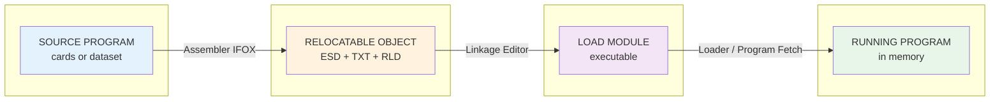
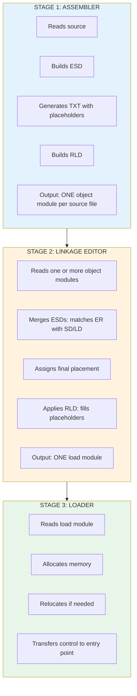

# How the IFOX Assembler Builds Relocatable Object Files

A guide for non-mainframe experts: passes, ESD, RLD, and the assembly-to-execution pipeline.

---

## Color Key

| Color | Meaning |
|-------|---------|
| Source / Input | What goes in |
| Processing | Transformation steps |
| Metadata (ESD, RLD) | Control information |
| Machine Code | Executable output |
| Storage / Files | Workfiles, object deck |

---

## The Big Picture: From Source to Running Program

**Pipeline:** Source → Object (ESD+TXT+RLD) → Load Module → Running Program

<small>Note: On S/370, source files have no special extension — the system uses DD names (SYSIN, SYSLIB) and dataset names, not file extensions like .asm.</small>

---

## Part 1: The Assembler's Multi-Pass Design

### Why Multiple Passes?

In the 1970s, mainframe memory was tiny (often 64K–256K bytes). You could not hold a full program and all its tables in memory at once. The solution: **process the source in several passes**, each doing one job and writing intermediate results to disk.

<strong>1970s CONSTRAINT: Limited Memory</strong>
<ul style="margin:8px 0 0 0;">
<li>System/360 "F" machine = 64K total (20K for OS, ~44K for programs)</li>
<li>Assembler must fit in memory AND process large source files</li>
<li>Solution: Read source once per pass, write to workfiles (SYSUT1-3)</li>
<li>Each phase loads, runs, then is DELETED to free memory for the next</li>
</ul>

### The IFOX Phase Flow

IFOX uses **phases** (subroutines loaded one at a time) instead of a single monolithic program:

IFOX DRIVER (stays in memory)

LOAD → RUN → DELETE (free memory) → LOAD next...

EDIT (X11)
→
DICT RES. (X21)
→
GEN (X31)
→
SYMBOL RES. (X41/42)
→
OUTPUT LISTER (X51)
→
RLD & XREF (X61)

WORKFILES (SYSUT1, SYSUT2, SYSUT3) — intermediate data between phases

**Pass A (Edit + Generate):** Read source, expand macros, build symbol tables.  
**Pass B (Dictionary + Generator):** Resolve symbols, generate object code.  
**Output:** Relocatable object deck (80-byte records) to SYSGO (object file).

---

## Part 2: The Relocatable Object File — ESD, TXT, RLD

The assembler writes a **relocatable object module**: machine code plus metadata so the linkage editor and loader can place and fix addresses later.

### Object Module Structure (80-byte card format)

The object module is a <strong>sequence of 80-byte records</strong> — like a deck of punched cards, read top to bottom. Each record type has a specific role:

  <!-- Card 1: ESD -->
  

    
ESD

    
External Symbol Dictionary — <em>must come first</em>

    

      Who is defined here? What do we need from elsewhere? 
      SD Section &nbsp; LD Label &nbsp; ER External Ref &nbsp; PR Pseudo-Register
    

  

  <!-- Connector -->
  

  <!-- Card 2: TXT -->
  

    
TXT

    
Machine code and data

    

      Actual bytes to load. Addresses are <strong>relative</strong> (not final).
    

  

  <!-- Connector -->
  

  <!-- Card 3: RLD -->
  

    
RLD

    
Relocation &amp; Linkage Dictionary

    

      "At offset X in section Y, put the address of symbol Z"
    

  

  <!-- Connector -->
  

  <!-- Card 4: END -->
  

    
END

    
End of module

  

  <svg width="120" height="24" viewBox="0 0 120 24" style="vertical-align:middle;margin-right:4px;">
    <rect x="0" y="4" width="80" height="16" fill="#e0e0e0" stroke="#9e9e9e" stroke-width="1" rx="2"/>
    <line x1="10" y1="8" x2="70" y2="8" stroke="#9e9e9e" stroke-width="0.5"/>
    <line x1="10" y1="12" x2="70" y2="12" stroke="#9e9e9e" stroke-width="0.5"/>
    <line x1="10" y1="16" x2="70" y2="16" stroke="#9e9e9e" stroke-width="0.5"/>
    <text x="40" y="22" font-size="6" fill="#616161" text-anchor="middle">80 bytes</text>
  </svg>
  Each record = one 80-byte card

### ESD: The "Phone Book" of Symbols

  

    
ESD = External Symbol Dictionary

    
Answers: "What symbols does this module define? What does it need?"

    <table style="width:100%;border-collapse:collapse;background:rgba(255,255,255,0.7);border-radius:4px;overflow:hidden;">
      <tr style="background:#e65100;color:white;"><th style="padding:10px;text-align:left;">TYPE</th><th style="padding:10px;text-align:left;">MEANING</th><th style="padding:10px;text-align:left;">EXAMPLE</th></tr>
      <tr style="border-bottom:1px solid #ddd;"><td style="padding:10px;">SD</td><td style="padding:10px;">Section Definition</td><td style="padding:10px;">"MYCODE" is a 100-byte code section</td></tr>
      <tr style="border-bottom:1px solid #ddd;"><td style="padding:10px;">LD</td><td style="padding:10px;">Label Definition</td><td style="padding:10px;">"START" is an entry point at offset 0</td></tr>
      <tr style="border-bottom:1px solid #ddd;"><td style="padding:10px;">ER</td><td style="padding:10px;">External Reference</td><td style="padding:10px;">"PRINT" is defined somewhere else</td></tr>
      <tr><td style="padding:10px;">PR</td><td style="padding:10px;">Pseudo-Register (XD)</td><td style="padding:10px;">"BUF" is a dummy section for addressing</td></tr>
    </table>
  

### RLD: The "Fix-Up List"

The assembler does **not** know final addresses. It emits **placeholders** and records where they are:

  

    
RLD = Relocation &amp; Linkage Dictionary

    
Each RLD entry says: "At this location, put the address of that symbol"

  

  

  

    
Source

    

      E &nbsp;&nbsp;DC &nbsp;&nbsp;A(EXTERNAL+4)
    

    
Address constant — value unknown at assembly time

  

  

  

    
RLD entry

    

      R=EXTERNAL's ESDID, P=this section, Address=offset, Length=4, Type=A
    

  

  

  

    
When the LINKAGE EDITOR runs

    <ol style="margin:8px 0 0 0;padding-left:20px;">
      <li style="margin-bottom:4px;">It knows where EXTERNAL ended up (from ESD of another module)</li>
      <li style="margin-bottom:4px;">It finds the TXT byte at the given offset</li>
      <li>It <strong>REPLACES</strong> the placeholder with the real address</li>
    </ol>
  

### How RLD Adjusts Displacements

  

    
BEFORE LINK

    
In the object module — placeholder in TXT

    

      [instruction] ???? [instruction] ...
    

    
RLD says: "Put address of FOO here"

  

  

    linkage editor applies RLD
  

  

    
AFTER LINK

    
Placeholder replaced with real address

    

      [instruction] 0x00012345 [instruction] ...
    

    
Real address where FOO was placed by the linkage editor

  

---

## Part 3: The Assembler, Linkage Editor, and Loader — Working Together

The assembler, linkage editor, and loader form a **pipeline**. Each step adds information the next step needs.

### The Three-Stage Pipeline

### How They Use Each Other's Output

  

    
1. ASSEMBLER

    
<strong>Input:</strong> Source deck (cards or dataset)

    
<strong>Produces:</strong>

    <ul style="margin:0 0 8px 0;padding-left:20px;font-size:0.9em;">
      <li><strong>ESD</strong> — defines symbols, lists external refs</li>
      <li><strong>TXT</strong> — machine code with placeholders</li>
      <li><strong>RLD</strong> — where each placeholder goes</li>
    </ul>
    
Output: Object module

  

  

  

    
2. LINKAGE EDITOR

    
<strong>Input:</strong> Object module(s)

    
<strong>Uses ESD to:</strong>

    <ul style="margin:0 0 8px 0;padding-left:20px;font-size:0.9em;">
      <li>Match external refs to definitions</li>
      <li>Assign final addresses</li>
      <li>Apply RLD — fill placeholders</li>
    </ul>
    
Output: Load module

  

  

  

    
3. LOADER

    
<strong>Input:</strong> Load module

    
<strong>Does:</strong>

    <ul style="margin:0 0 8px 0;padding-left:20px;font-size:0.9em;">
      <li>Allocates memory</li>
      <li>Copies code, relocates if needed</li>
      <li>Starts program at entry point</li>
    </ul>
    
Output: Running program

  

  

    Data flow:
    Object Module(s)
    →
    Load Module
    →
    Program in Memory
  

### Concrete Example: S/370 Program and Object Module Construction

Here is a minimal S/370 program split into two modules. Source is typically on punched cards or in a dataset — **file extensions have no meaning** on S/370; the system uses DD names (SYSIN, SYSLIB) and member names.

  

    
Source deck 1 — MAIN (calls SUB)

    <pre style="margin:0;font-size:0.85em;background:rgba(255,255,255,0.8);padding:12px;border-radius:4px;overflow-x:auto;">MAIN     CSECT
         EXTRN SUB
         STM   14,12,12(13)
         LR    12,15
         USING MAIN,12
         L     15,=A(SUB)
         BALR  14,15
         LM    14,12,12(13)
         BR    14
         LTORG
         END   MAIN</pre>
  

  

    
Source deck 2 — SUB (subroutine)

    <pre style="margin:0;font-size:0.85em;background:rgba(255,255,255,0.8);padding:12px;border-radius:4px;overflow-x:auto;">SUB      CSECT
         ENTRY SUB
         BR    14
         END   SUB</pre>
  

  
Step 1 — Assembler produces object for MAIN

  

    
MAIN source

    
→

    
Assembler

  

  
Object module structure:

  

    
ESD

    
SD MAIN (section) · ER SUB ("I need SUB")

  

  

  

    
TXT

    
STM, LR, L, BALR, LM, BR

    
L 15,=A(SUB) → placeholder (SUB unknown)

  

  

  

    
RLD

    
At offset of =A(SUB) → put SUB's address when known

  

  
Step 2 — Assembler produces object for SUB

  

    
SUB source

    
→

    
Assembler

  

  
Object module structure:

  

    
ESD

    
SD SUB (section) · LD SUB (entry point)

  

  

  

    
TXT

    
BR 14 — no placeholders

  

  

  

    
RLD

    
(none — no address constants)

  

  
Step 3 — Linkage editor combines and resolves

  

    

      
Input

      
MAIN object

      
ER SUB

    

    

      
Input

      
SUB object

      
SD SUB, LD SUB

    

  

  

    
LINKAGE EDITOR

    

      1. Match
      ER SUB
      ↔
      SD SUB
    

    

      2. Place
      MAIN + SUB in load module, compute SUB's address
    

    

      3. Apply RLD
      Replace placeholder in MAIN with SUB's real address
    

  

  

  

    
LOAD MODULE

    
One executable: MAIN + SUB, all refs resolved. Loader copies into memory and starts at MAIN.

  

### Two Modules — Visual Summary

  

    

      
MAIN (object)

      

        
<strong>ESD</strong> SD MAIN, ER SUB

        
<strong>TXT</strong> code + placeholder

        
<strong>RLD</strong> fix =A(SUB)

      

    

    

      
SUB (object)

      

        
<strong>ESD</strong> SD SUB, LD SUB

        
<strong>TXT</strong> BR 14

        
<strong>RLD</strong> none

      

    

  

  

    
LINKAGE EDITOR

    
ER SUB ↔ SD SUB · places both · applies RLD

  

  

  

    
LOAD MODULE

    
MAIN + SUB in one executable · all refs fixed

  

### Why This Design Was Smart in the 1970s

| Constraint | How the design responds |
|------------|-------------------------|
| **Little memory** | Assembler uses phases: load one, run, delete, load next. Workfiles hold intermediate data. |
| **Slow CPU** | Each tool does one job. No need to re-parse source during link. |
| **Expensive disk** | 80-byte card format is compact. ESD/RLD are small compared to full symbol tables. |
| **Separate compile** | You can change one module and relink without reassembling everything. |
| **Shared libraries** | Linkage editor can pull in pre-built object libraries (e.g. I/O routines). |

---

## Summary

  

    
<strong>SOURCE</strong> <small>cards / dataset</small>

    

    
<strong>ASSEMBLER</strong> <small>ESD + TXT + RLD</small>

    

    
<strong>LINKAGE EDITOR</strong> <small>Load Module</small>

    

    
<strong>LOADER</strong> <small>Running Program</small>

  

  

    "What &amp; where"
    "Combine &amp; fix"
    "Load &amp; go"
  

The assembler produces **relocatable** output (ESD + TXT + RLD). The linkage editor **resolves** it into a load module. The loader **places** it in memory and **starts** it. Each stage uses the previous one's output and adds the next layer of binding.
