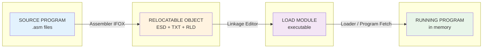
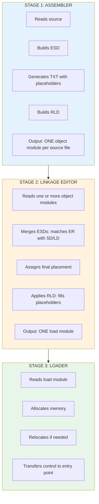

# How the IFOX Assembler Builds Relocatable Object Files

A guide for non-mainframe experts: passes, ESD, RLD, and the assembly-to-execution pipeline.

---

## Color Key

| Color | Meaning |
|-------|---------|
| <span style="color:#1565c0;font-weight:bold">Source / Input</span> | What goes in |
| <span style="color:#2e7d32;font-weight:bold">Processing</span> | Transformation steps |
| <span style="color:#e65100;font-weight:bold">Metadata (ESD, RLD)</span> | Control information |
| <span style="color:#6a1b9a;font-weight:bold">Machine Code</span> | Executable output |
| <span style="color:#616161;font-weight:bold">Storage / Files</span> | Workfiles, object deck |

---

## The Big Picture: From Source to Running Program



**Pipeline:** <span style="color:#1565c0">Source</span> → <span style="color:#e65100">Object (ESD+TXT+RLD)</span> → <span style="color:#6a1b9a">Load Module</span> → <span style="color:#2e7d32">Running Program</span>

---

## Part 1: The Assembler's Multi-Pass Design

### Why Multiple Passes?

In the 1970s, mainframe memory was tiny (often 64K–256K bytes). You could not hold a full program and all its tables in memory at once. The solution: **process the source in several passes**, each doing one job and writing intermediate results to disk.

```
+-----------------------------------------------------------------------------+
|  1970s CONSTRAINT: Limited Memory                                           |
+-----------------------------------------------------------------------------+
|  * System/360 "F" machine = 64K total (20K for OS, ~44K for programs)       |
|  * Assembler must fit in memory AND process large source files              |
|  * Solution: Read source once per pass, write to workfiles (SYSUT1-3)        |
|  * Each phase loads, runs, then is DELETED to free memory for the next      |
+-----------------------------------------------------------------------------+
```

### The IFOX Phase Flow

IFOX uses **phases** (subroutines loaded one at a time) instead of a single monolithic program:

```
+-------------------------------------------------------------------------------+
|  IFOX DRIVER (stays in memory)                                                |
+-------------------------------------------------------------------------------+
         |
         |  LOAD -> RUN -> DELETE (free memory) -> LOAD next...
         v
+--------+   +--------+   +--------+   +--------+   +--------+   +--------+
|  EDIT  | ->|  DICT  | ->|  GEN   | ->| SYMBOL | ->| OUTPUT | ->|  RLD & |
|  (X11) |   |  RES.  |   | (X31)  |   |  RES.  |   | LISTER |   |  XREF  |
|        |   | (X21)  |   |        |   |(X41/42)|   | (X51)  |   | (X61)  |
+--------+   +--------+   +--------+   +--------+   +--------+   +--------+
     |             |             |
     v             v             v
+-------------------------------------------------------------------------------+
|  WORKFILES (SYSUT1, SYSUT2, SYSUT3) - intermediate data between phases       |
+-------------------------------------------------------------------------------+
```

**Pass A (Edit + Generate):** Read source, expand macros, build symbol tables.  
**Pass B (Dictionary + Generator):** Resolve symbols, generate object code.  
**Output:** Relocatable object deck (80-byte records) to SYSGO (object file).

---

## Part 2: The Relocatable Object File — ESD, TXT, RLD

The assembler writes a **relocatable object module**: machine code plus metadata so the linkage editor and loader can place and fix addresses later.

### Object Module Structure (80-byte card format)

```
+-----------------------------------------------------------------------------+
|  OBJECT MODULE = sequence of 80-byte records (like punched cards)          |
+-----------------------------------------------------------------------------+

+------------------------------------------------------------------------------+
|  ESD (External Symbol Dictionary)  - MUST COME FIRST                         |
|  +-----------------------------------------------------------------------+   |
|  |  Who is defined here?  What do we need from elsewhere?                |   |
|  |  SD=Section, LD=Label/Entry, ER=External Ref, PR=Pseudo-Register       |   |
|  +-----------------------------------------------------------------------+   |
+------------------------------------------------------------------------------+
                                    |
                                    v
+------------------------------------------------------------------------------+
|  TXT (Text) - Machine code and data                                          |
|  +-----------------------------------------------------------------------+   |
|  |  Actual bytes to load.  Addresses are RELATIVE (not final).            |   |
|  +-----------------------------------------------------------------------+   |
+------------------------------------------------------------------------------+
                                    |
                                    v
+------------------------------------------------------------------------------+
|  RLD (Relocation & Linkage Dictionary) - Where to fix addresses             |
|  +-----------------------------------------------------------------------+   |
|  |  "At offset X in section Y, put the address of symbol Z"               |   |
|  +-----------------------------------------------------------------------+   |
+------------------------------------------------------------------------------+
                                    |
                                    v
+------------------------------------------------------------------------------+
|  END - End of module                                                         |
+------------------------------------------------------------------------------+
```

### ESD: The "Phone Book" of Symbols

```
+-----------------------------------------------------------------------------+
|  ESD = External Symbol Dictionary                                            |
|  Answers: "What symbols does this module define? What does it need?"         |
+-----------------------------------------------------------------------------+

  TYPE    MEANING                    EXAMPLE
  -------------------------------------------------------------------------------
  SD      Section Definition         "MYCODE" is a 100-byte code section
  LD      Label Definition           "START" is an entry point at offset 0
  ER      External Reference         "PRINT" is defined somewhere else
  PR      Pseudo-Register (XD)       "BUF" is a dummy section for addressing
```

### RLD: The "Fix-Up List"

The assembler does **not** know final addresses. It emits **placeholders** and records where they are:

```
+-----------------------------------------------------------------------------+
|  RLD = Relocation & Linkage Dictionary                                       |
|  Each RLD entry says: "At this location, put the address of that symbol"     |
+-----------------------------------------------------------------------------+

  Source:     E    DC    A(EXTERNAL+4)     <- Address constant, value unknown
                    |
                    v
  RLD entry:  R=EXTERNAL's ESDID, P=this section, Address=offset, Length=4, Type=A

  When the LINKAGE EDITOR runs:
    1. It knows where EXTERNAL ended up (from ESD of another module)
    2. It finds the TXT byte at the given offset
    3. It REPLACES the placeholder with the real address
```

### How RLD Adjusts Displacements

```
  BEFORE LINK (in object module):
  +-----------------------------------------------------------------+
  |  TXT:  [instruction] [????] [instruction] ...                  |
  |                    ^                                            |
  |                    placeholder (e.g. 0 or relative value)         |
  |                    RLD says: "Put address of FOO here"          |
  +-----------------------------------------------------------------+

  AFTER LINK (linkage editor applies RLD):
  +-----------------------------------------------------------------+
  |  TXT:  [instruction] [0x00012345] [instruction] ...            |
  |                    ^                                             |
  |                    real address where FOO was placed             |
  +-----------------------------------------------------------------+
```

---

## Part 3: The Assembler, Linkage Editor, and Loader — Working Together

The assembler, linkage editor, and loader form a **pipeline**. Each step adds information the next step needs.

### The Three-Stage Pipeline



### How They Use Each Other's Output

```
+-------------+         +---------------------+         +-------------+
|  ASSEMBLER  |         |  LINKAGE EDITOR     |         |   LOADER   |
+------+------+         +----------+----------+         +------+-----+
       |                           |                           |
       |  ESD: "I define FOO,      |  Uses ESD to:              |  Uses load
       |        I need BAR"         |  * Match BAR to its def   |  module to:
       |                            |  * Assign addresses       |  * Copy code
       |  TXT: code + placeholders  |  * Resolve all refs       |  * Relocate
       |                            |                           |  * Start PC
       |  RLD: "fix offset 12       |  Produces:                 |
       |        with address of     |  * Single executable      |
       |        BAR"                |  * All refs resolved      |
       |                            |                           |
       v                            v                           v
+-------------+         +---------------------+         +-------------+
| Object      |   -->   | Load Module          |   -->   | Program     |
| Module(s)   |         | (ready to run)       |         | in Memory   |
+-------------+         +---------------------+         +-------------+
```

### Example: Two Modules Linked Together

```
  MODULE A (main):                    MODULE B (subroutine):
  +-------------------------+        +-------------------------+
  |  ESD: MAIN (SD), CALL SUB(ER)     |  ESD: SUB (SD, LD)       |
  |  TXT: BALR R14,R15  ; call SUB   |  TXT: ... code for SUB    |
  |  RLD: "R15 = address of SUB"     |  RLD: (internal only)     |
  +-------------------------+        +-------------------------+
              |                                    |
              +----------------+-------------------+
                              |
                              v
  +-----------------------------------------------------------------+
  |  LINKAGE EDITOR                                                 |
  |  1. Sees A needs SUB (ER)                                       |
  |  2. Sees B defines SUB (SD/LD)                                  |
  |  3. Places B's code, computes SUB's address                     |
  |  4. Uses RLD from A to put SUB's address into the call          |
  +-----------------------------------------------------------------+
                              |
                              v
  +-----------------------------------------------------------------+
  |  LOAD MODULE: One contiguous program with MAIN and SUB, fixed   |
  +-----------------------------------------------------------------+
```

### Why This Design Was Smart in the 1970s

| Constraint | How the design responds |
|------------|-------------------------|
| **Little memory** | Assembler uses phases: load one, run, delete, load next. Workfiles hold intermediate data. |
| **Slow CPU** | Each tool does one job. No need to re-parse source during link. |
| **Expensive disk** | 80-byte card format is compact. ESD/RLD are small compared to full symbol tables. |
| **Separate compile** | You can change one module and relink without reassembling everything. |
| **Shared libraries** | Linkage editor can pull in pre-built object libraries (e.g. I/O routines). |

---

## Summary

```
  SOURCE          ASSEMBLER              LINKAGE EDITOR           LOADER
  ------          ---------              ---------------          ------

  .asm     -->  ESD + TXT + RLD    -->   Load Module      -->   Running
  files         (object deck)            (resolved)               Program
                    |                         |                        |
                    |                         |                        |
              "What & where"            "Combine & fix"           "Load & go"
```

The assembler produces **relocatable** output (ESD + TXT + RLD). The linkage editor **resolves** it into a load module. The loader **places** it in memory and **starts** it. Each stage uses the previous one's output and adds the next layer of binding.
